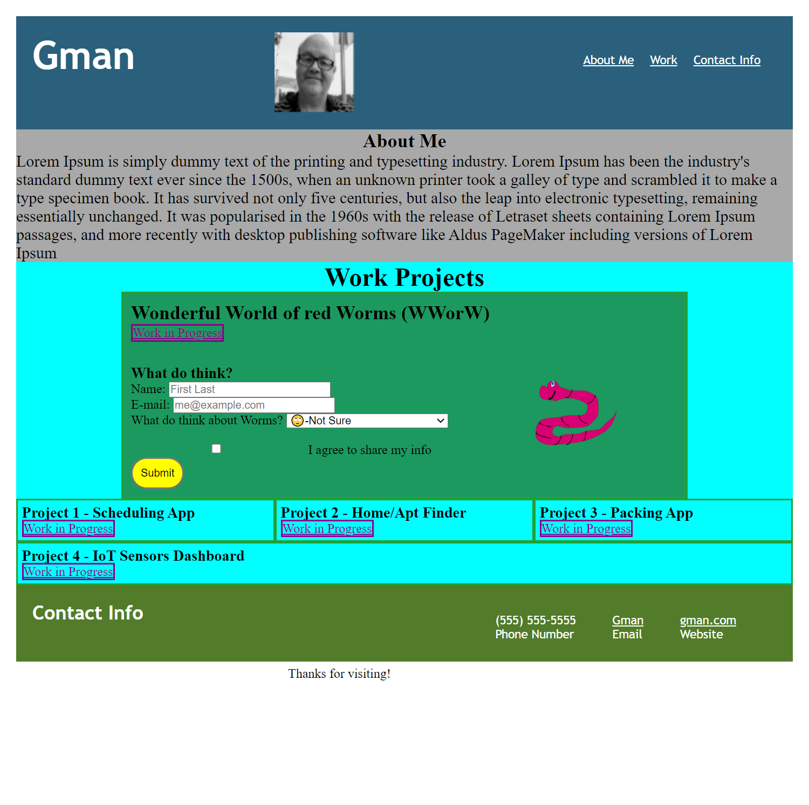
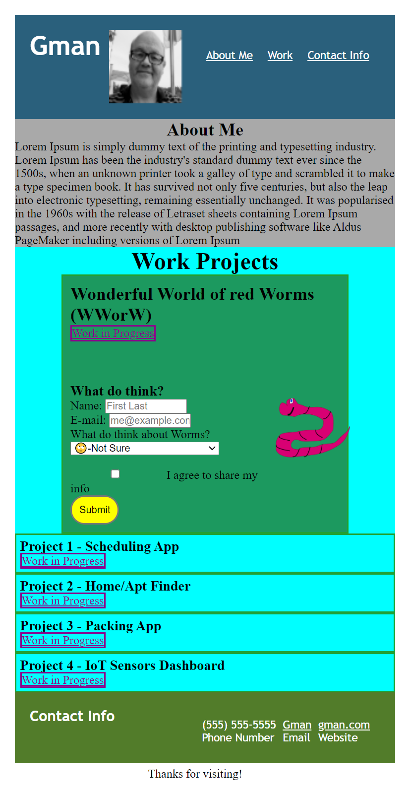

# Gman-Portfolio
First Draft on Portfolio Page 

# Working Files
HTML,CSS Files: https://github.com/gmcmurray/Gman-Portfolio

Deployed Application: https://gmcmurray.github.io/Gman-Portfolio/

Supporting Page: https://gmcmurray.github.io/workinprogress/

## Description 

Using flex boxes create a site which will highlight your portfolio of projects
with main project presenting larger than 4 other subprojects. Page should
reformat nicely (still easy to read) with different widths (from 550px to 1200 px).
The scaling of style was implemented through media query. 
Required features are : links from subprojects to external page, nav link at top
to contact me info, picture of myself in page (at top) and media friendly.  External
page is call WorkinProgress and outlines subprojects highlights and provides return
link to portfolio.

Additional features include use of psuedo class :hover, css form, rounded corners
and alert method in the main project response for hyperlink.

## Screen Shot
Screen shot with width of 1000 pixels, and 550 pixels below.

1000 pixels:

550 pixels:

