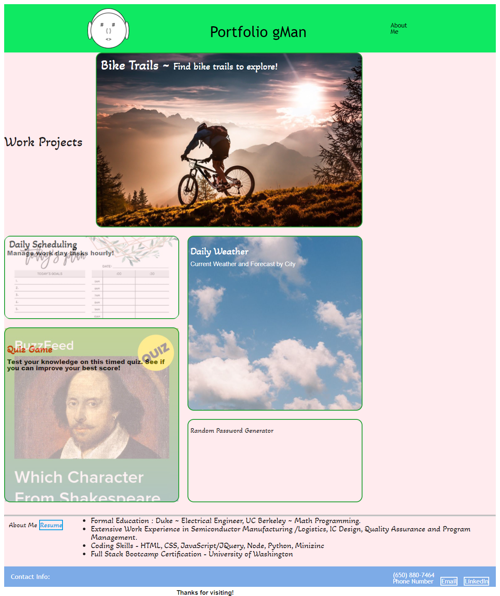
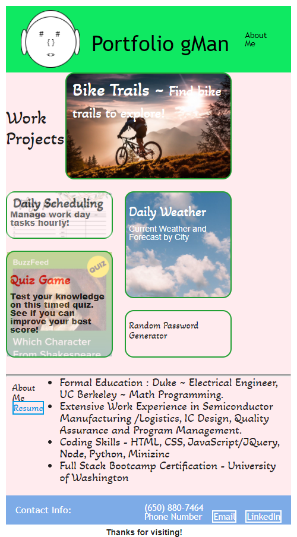

# Gman-Portfolio
Second Draft on Portfolio Page 

# Working Files
HTML,CSS Files: https://github.com/gmcmurray/Gman-Portfolio

Deployed Application: https://gmcmurray.github.io/Gman-Portfolio/

## Description 

Using grid and flex boxes refactored a site which highlights my portfolio of projects with main project presenting larger than 4 other subprojects. Page should
reformat nicely (still easy to read) with different widths (from 500px to 1200 px).
The scaling of style was implemented through javascript function which updated css classes of the project containers. 
Project 1 and other homeworks are linked by clicking on the project container.  This opens a new window to the application selected.

## Screen Shot
Screen shot with width of 1200 pixels, and 500 pixels below.

1200 pixels:

500 pixels:

